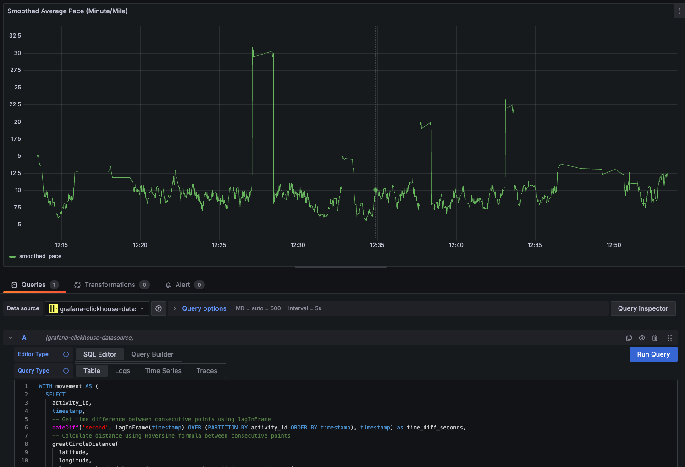

# GPX to ClickHouse Processor Demo

> This repo is paired with my article on ClickHouse processing for GPX data.

Process GPX files from Strava exports and store them in ClickHouse for analysis using tools like Grafana or Tabix.

- Demo purposes only
- Only supports GPX
- Only supports running activities

## Prerequisites

- Node.js (v18+)
- ClickHouse server running locally or remotely
- GPX files from Strava export

## Installation

1. Clone the repository
2. Run the containers (ClickHouse, Tabix & Grafana): `docker compose up -d`
3. Install dependencies: `yarn install`
4. `yarn dev` or `yarn dev:verbose` to read GPX data into ClickHouse

## Configuration

The application can be configured using environment variables or you can read via `src/config.ts`:

| Variable              | Description                                     | Default                             |
| --------------------- | ----------------------------------------------- | ----------------------------------- |
| `CLICKHOUSE_URL`      | ClickHouse server URL                           | `http://localhost:8123`             |
| `CLICKHOUSE_USERNAME` | ClickHouse username                             | `schachte`                          |
| `CLICKHOUSE_PASSWORD` | ClickHouse password                             | `password`                          |
| `BATCH_SIZE`          | Number of track points to process in each batch | `10000`                             |
| `ACTIVITIES_DIR`      | Directory containing GPX files                  | `./activities`                      |
| `DEBUG`               | Debug logging configuration                     | `DEBUG=gpx:*,-gpx:process yarn dev` |
